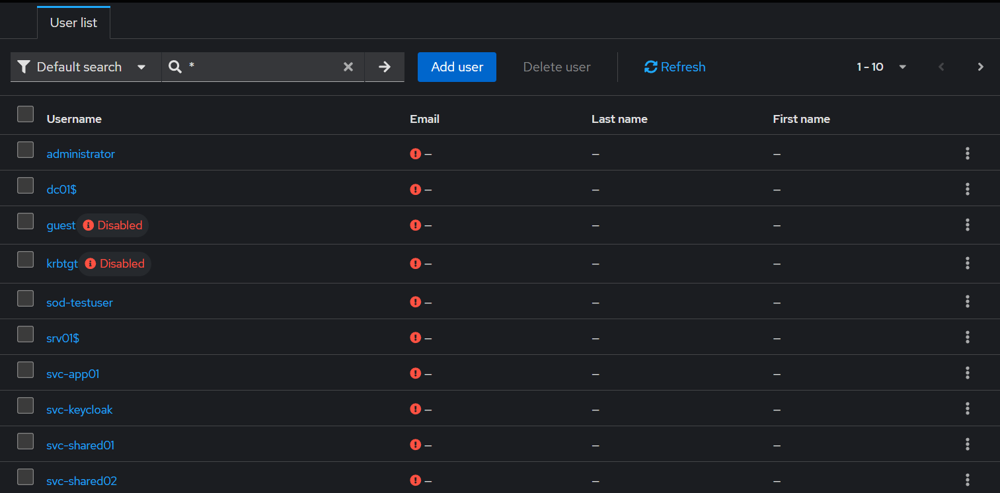
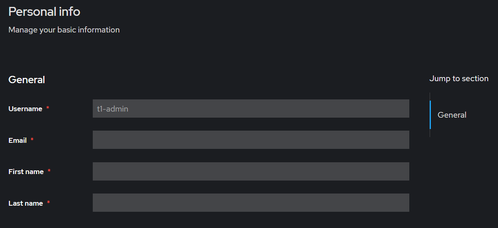
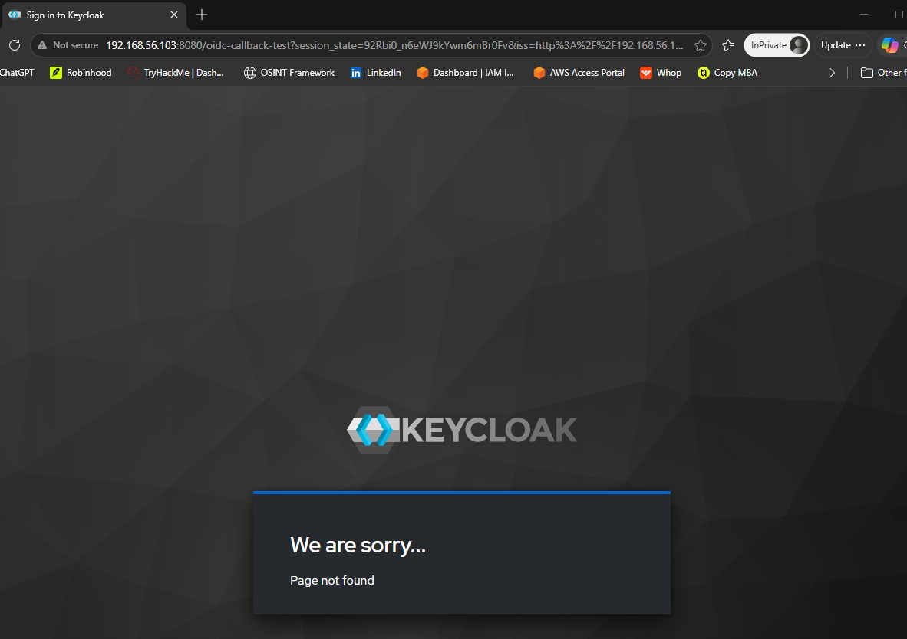
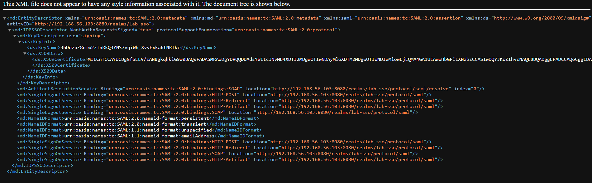
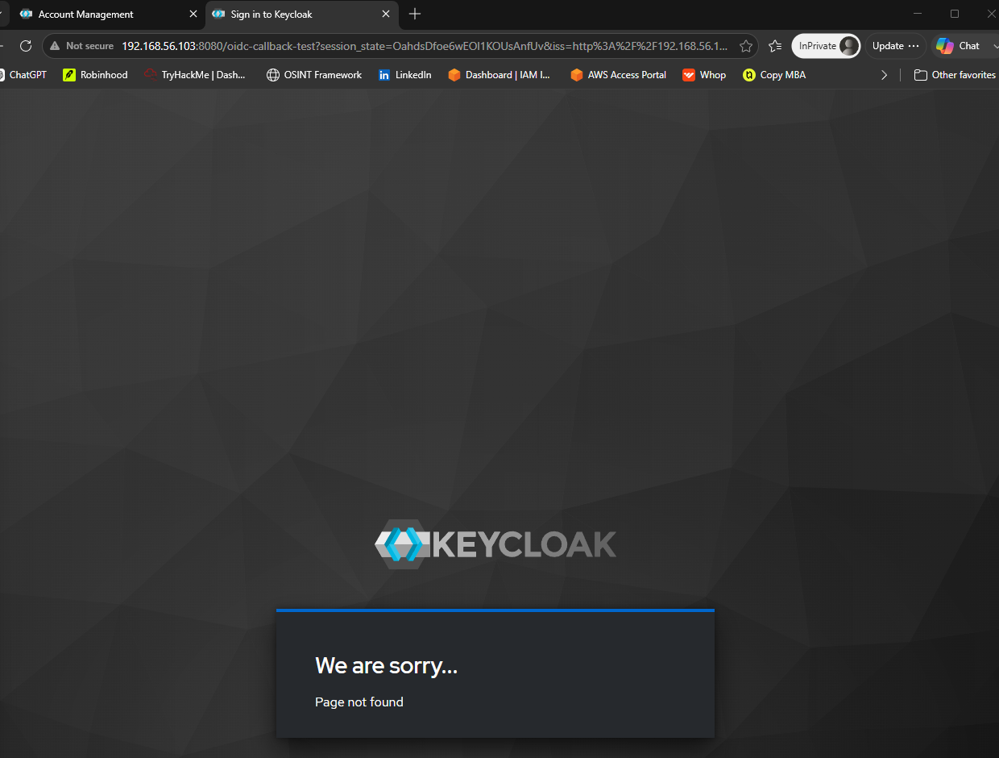

# Keycloak SSO & Active Directory Federation

A self-hosted identity federation and Single Sign-On (SSO) lab: Keycloak stood up
as an identity provider, federated to Active Directory over LDAPS, authenticating
domain users and brokering SSO across applications using both dominant federation
protocols — **OIDC** and **SAML**.

> **Why this exists.** Modern access relies on a central identity provider that
> authenticates users once and brokers that identity to many applications over
> standard federation protocols. This lab reproduces that pattern with Keycloak
> (the open-source analog to Okta / Entra ID SSO), federated to the same Active
> Directory used across the companion projects.

This is the **federation / authentication** pillar of a three-part IAM portfolio,
alongside the
[Tiered Privileged Access Lab](https://github.com/trenton-carter/tiered-pam-lab)
(privileged access) and the
[AD Identity Governance Toolkit](https://github.com/trenton-carter/ad-governance-toolkit)
(governance). Together they cover the three pillars of identity and access
management.

Every capability is **built and verified** — AD users synced over LDAPS, a domain
user authenticating with their AD password, the OIDC authorization-code flow, the
SAML IdP metadata, and SSO across applications.

---

## What this demonstrates

| Capability | What it proves | Evidence |
|------------|----------------|----------|
| AD federation over LDAPS | Keycloak authenticates against Active Directory; 14 domain users synced read-only |  |
| AD-backed authentication | A domain user logs in with their real AD password |  |
| OIDC (OpenID Connect) | Full authorization-code flow with an AD identity |  |
| SAML 2.0 | Keycloak serves signed SAML IdP metadata (SSO + SLO endpoints) |  |
| Single Sign-On | One login, access to a second application with no re-authentication |  |

Full walkthrough: [docs/keycloak-ad-federation.md](docs/keycloak-ad-federation.md)

---

## Architecture

| Host  | Role                                   | OS                  |
|-------|----------------------------------------|---------------------|
| IDP01 | Keycloak identity provider             | Ubuntu Server 24.04 |
| DC01  | Active Directory + LDAPS (federation target) | Windows Server 2025 |

- Keycloak **26.5** (Community), Java 21, `start-dev` mode
- Realm: `lab-sso`
- Federation: LDAP user federation, `READ_ONLY`, over **LDAPS** (`ldaps://dc01.lab.local:636`)
- Bind account: `svc-keycloak` — a dedicated **read-only** AD service account (least privilege)
- Isolated lab network `10.10.10.0/24`; admin console reached from host over a host-only interface

---

## Requirements this lab demonstrates

Phrases drawn from real IAM job descriptions.

| Requirement | Implemented by |
|-------------|----------------|
| Single Sign-On (SSO) | Session reuse across OIDC/SAML clients |
| Identity federation | Keycloak federated to Active Directory over LDAPS |
| OIDC / OAuth2 | OIDC client, authorization-code flow |
| SAML 2.0 | SAML client + IdP metadata with signing certificate |
| Identity provider (IdP) administration | Keycloak realm, clients, user federation |
| Active Directory integration | LDAPS bind + read-only user sync |
| Least privilege | Dedicated read-only bind account; READ_ONLY edit mode |

---

## Key design decisions

- **LDAPS, not plain LDAP.** The domain controller rejects unencrypted simple
  binds (`Strong(er) authentication required`), so federation uses LDAPS on 636
  with the AD CS CA certificate imported into the Java truststore — the same
  secure channel established in the PAM lab. AD is validated, not trusted blindly.
- **Read-only, least-privilege bind.** Keycloak binds with a dedicated
  `svc-keycloak` account and `READ_ONLY` edit mode, so Active Directory remains
  the single source of truth and Keycloak can never modify directory objects.
- **Both protocols.** OIDC (modern, OAuth2-based) and SAML 2.0 (enterprise XML
  standard) are both configured, demonstrating federation across the two
  protocols that appear together in essentially every IAM requirement list.

---

## At enterprise scale

Lab simplifications, and what production would change:

- **TLS on Keycloak.** Runs in `start-dev` (HTTP) for the lab; production uses
  `start` with a proper TLS certificate (issued by the internal CA) and a
  configured hostname.
- **Database.** Dev mode uses an embedded database; production uses an external
  RDBMS (PostgreSQL) with backups and HA.
- **Federation scope.** The lab imports all directory objects (including computer
  and built-in accounts); production adds a user LDAP filter to import only real
  user accounts.
- **Real service providers.** OIDC/SAML were exercised against test flows and the
  IdP metadata endpoint; production integrates actual applications as clients.

Naming these boundaries is deliberate — the lab proves the federation controls,
and this section marks where the lab ends and production begins.

---

## Skills demonstrated

Identity federation · Single Sign-On (SSO) · OIDC / OAuth2 · SAML 2.0 · Keycloak
identity provider administration · Active Directory / LDAPS integration · Java
truststore / certificate trust · least-privilege service accounts · Linux service
administration.
