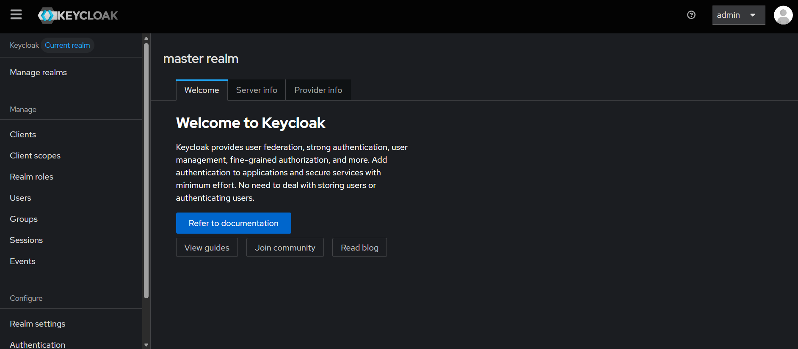

# Keycloak SSO & Active Directory Federation — Build Walkthrough

Standing up Keycloak as an identity provider, federating it to Active Directory
over LDAPS, and demonstrating SSO across applications with both OIDC and SAML.

## Environment

Keycloak 26.5 (Community) on a dedicated Ubuntu 24.04 host (IDP01), federated to
the existing `lab.local` domain (DC01). Running the IdP on its own host — not
co-located with the PAM tooling — mirrors production, where the identity provider
is its own tier.



## 1. Install and run Keycloak

Installed OpenJDK 21 (Keycloak 26 requires Java 17+; 21 matches the official
image), extracted Keycloak to `/opt/keycloak`, and started it in development mode
bound to all interfaces so the admin console is reachable from the host:

```bash
sudo apt install -y openjdk-21-jdk
# extract keycloak-26.5.0 to /opt/keycloak
export KC_BOOTSTRAP_ADMIN_USERNAME=admin
export KC_BOOTSTRAP_ADMIN_PASSWORD=<password>
cd /opt/keycloak
sudo -E bin/kc.sh start-dev --http-host=0.0.0.0 --http-port=8080
```

> **Lab vs. production.** `start-dev` uses HTTP and an embedded database — fine
> for demonstrating federation. Production uses `start` with a TLS certificate,
> a configured hostname, and an external database (PostgreSQL).

Created a dedicated realm, `lab-sso` (the master realm is for administering
Keycloak itself and never hosts real applications).

## 2. Active Directory federation over LDAPS

Configured LDAP user federation pointing at the domain controller, with a
dedicated read-only bind account.

**The LDAPS requirement.** An initial plain-LDAP (389) bind was rejected by the
DC:

```
ldap_bind: Strong(er) authentication required (8)
  The server requires binds to turn on integrity checking if SSL\TLS are not
  already active on the connection
```

Active Directory refuses unencrypted simple binds — the same security posture
that drove LDAPS in the PAM lab. The fix was to federate over **LDAPS** and
establish certificate trust:

1. Retrieved the DC's certificate and imported it into the Java truststore
   (`cacerts`) with `keytool`, so Keycloak (a JVM app) validates the LDAPS
   connection rather than skipping verification.
2. Set the federation **Connection URL** to `ldaps://dc01.lab.local:636`.
3. Bound with `svc-keycloak`, a dedicated **read-only** AD service account, with
   **Edit mode `READ_ONLY`** so AD stays the source of truth.
4. Set **Users DN** to `DC=lab,DC=local` and **Search scope** to `Subtree` to
   resolve users across the nested OU structure.

Verified independently from the IdP host before trusting Keycloak's own sync:

```bash
LDAPTLS_REQCERT=never ldapsearch -x -H ldaps://dc01.lab.local:636 \
  -D "CN=svc-keycloak,OU=ServiceAccounts,OU=Tier1,OU=Admin,DC=lab,DC=local" \
  -w '<password>' -b "DC=lab,DC=local" "(objectClass=user)" sAMAccountName
```

A user sync then imported the domain users into the realm read-only:

```
Sync all users finished: 14 imported users, 0 updated users
```


> **Production note.** The lab imports all directory objects (including computer
> accounts and built-in accounts like `krbtgt`). Production adds a user LDAP
> filter to import only real user accounts.

## 3. AD-backed authentication

A domain user (`t1-admin`) authenticated to Keycloak's account console using
their **Active Directory password**, validated against AD over LDAPS in real
time — proving true federation, not just a username import.


## 4. OIDC (OpenID Connect)

Created an OIDC client (`oidc-demo-app`, confidential, standard flow) and walked
the **authorization-code flow**: the browser hits Keycloak's authorization
endpoint, the AD user authenticates, and Keycloak redirects to the client's
callback with an authorization `code` (and `session_state`, `iss`). The 404 at
the callback is expected — no application is deployed there; the redirect *with
the code* is the proof.


**Concept.** This is the OAuth2 authorization-code flow behind every "Log in
with..." button: app → IdP authorization endpoint → user authenticates → redirect
back with a short-lived code the app exchanges for tokens.

## 5. SAML 2.0

Created a SAML client and confirmed Keycloak serves standard SAML IdP metadata at
`/realms/lab-sso/protocol/saml/descriptor` — a signed `EntityDescriptor` with the
IdP signing certificate, SingleSignOnService and SingleLogoutService endpoints
across all standard bindings, and supported NameID formats. This metadata is the
federation contract handed to any SAML service provider to establish trust.


**Concept.** SAML (XML-based, enterprise-entrenched) and OIDC (JSON/OAuth2-based,
modern) solve the same SSO problem via different mechanisms. Demonstrating both
covers the two protocols that appear together in essentially every IAM
requirement list.

## 6. Single Sign-On

With an existing session from one application, accessing a second client issued
an authorization code **without a second login prompt** — Keycloak reused the
session. One authentication, access to multiple applications: single sign-on.


## Outcome

A working identity provider federated to Active Directory over LDAPS,
authenticating domain users and brokering SSO across applications via both OIDC
and SAML. Combined with the PAM lab and the governance toolkit, this completes a
three-pillar IAM portfolio: privileged access, governance, and federation.
